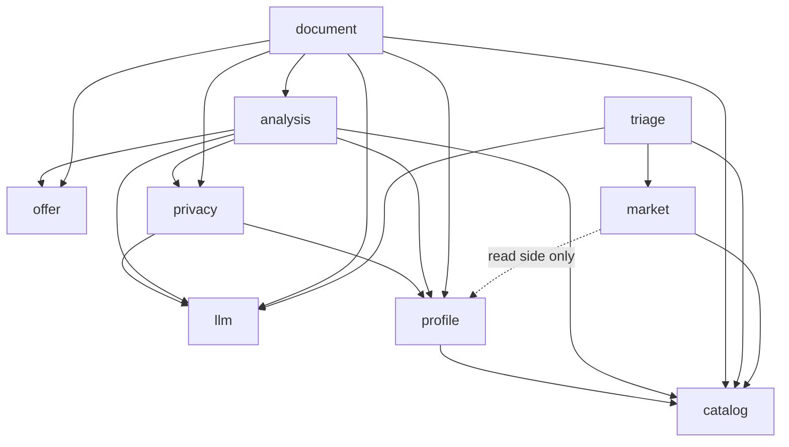
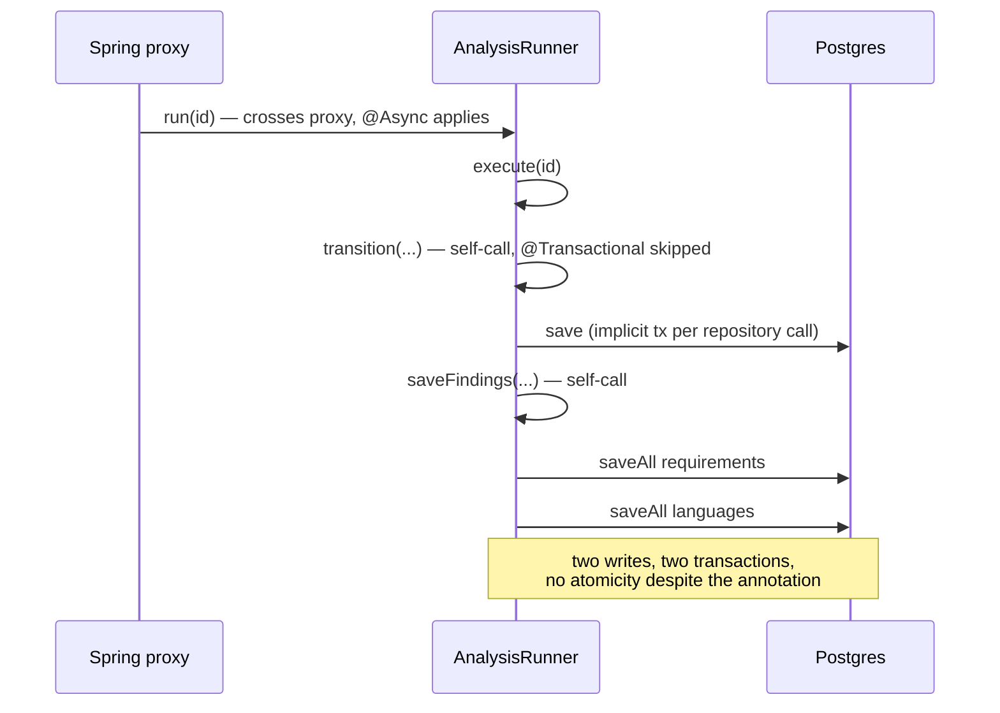
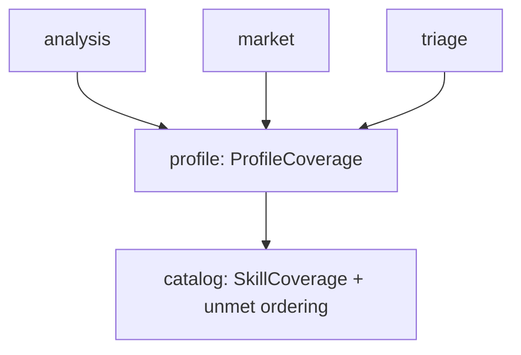

# Architecture review — August 2026

A snapshot review of where the codebase is **shallow**: places where a module's interface is nearly
as large as what sits behind it, where a concept is re-typed rather than named, or where a seam that
should exist does not. Taken at `ae53c59`, weighted toward what the preceding forty commits actually
touched — `profile`, `llm` and the `market` read side.

This is a review, not a decision. Nothing here has been agreed; `docs/roadmap.md` is where decisions
already taken live, and this file is an input to a conversation rather than a record of one. Where a
candidate contradicts something already settled — a stated convention, an ADR — it says so.

| | |
|---|---|
| Kotlin sources | 128 files, 10,724 lines |
| Kotlin tests | 58 files, four tiers |
| Modulith modules | 9 |
| Frontend | 11,470 lines of TS/TSX |
| Frontend tests | **0** |

## The module graph as it stands

Derived from actual imports rather than from `CLAUDE.md`. The dashed `market -> profile` edge was
undocumented when this review was written; candidate 3 explains it, and `CLAUDE.md` now describes it.



`catalog`, `llm` and `offer` still depend on nothing, which was the point of ADR-0003.

---

## 1. The profile collection is written out nine times

**Strength: strong.** Files: `profile/internal/ProfileWriteService.kt` (620),
`profile/internal/ProfileController.kt` (303), `profile/internal/ProfileRepositories.kt` (189),
`profile/internal/ProfileWriteRequests.kt` (119), `frontend/src/api/profile.ts` (126),
`frontend/src/routes/profile/*Card.tsx` (~1,900).

### Problem

Nine collections — links, skills, experiences, bullets, education, credentials, projects, consent
clauses, languages — each get `add`, `update`, `delete` and `reorder` written longhand. The
*interface* of `ProfileWriteService` is 36 methods wide and each one is six lines of the same shape:
check the parent exists, save a row, call `commit(profileId)`. That is the textbook **shallow**
module — the interface is as large as what sits behind it.

The cost is measurable in the git log. Three of the last fifteen commits — `82110ce` credentials,
`f43d0eb` projects, `b8f6320` consent clauses — each paid roughly 250 lines across six files to add
one more copy of a shape that already existed eight times.

### The deletion test

Deleting `ProfileWriteService` would just move 620 lines into the controller; that is not the
finding. The finding is that a concept with no name is being re-typed: *"an ordered, profile-owned
collection whose writes bump the revision and answer with the whole profile."* Give it a name and
eight of nine copies delete themselves — complexity concentrates rather than moves.

### What is actually untested

`reorder`'s "must name every id exactly once" rule, `nextOrder`'s profile scoping and `commit`'s
revision bump are properties of all nine collections but are asserted for one or two. There is no
**seam** at which to state them once.

### Solution

A `ProfileCollection<Row, Request>` behind which `add`/`update`/`delete`/`reorder` are written once,
plus nine descriptors naming a repository, a table and that entity's validation.

```
Before                              After
9 × 4 = 36 shallow methods          1 deep module + 9 descriptors
36 endpoints                        one generic route set
adding a collection = 250 lines     adding a collection = a descriptor
```

### Benefits

- **Locality.** Everything true of *every* profile collection sits in one file instead of being
  spread across nine near-identical stretches where a divergence is invisible.
- **Leverage.** The next aggregate costs a descriptor, not 250 lines through six files.
- **Test surface.** The reorder invariant and the revision bump become properties asserted once
  against the seam, and they then hold for collections that do not exist yet.
- The entity-specific parts that *are* deep — `deleteSkill`'s `blockingBullets` refusal,
  `requireDeclared`, the date-ordering checks — stay visible instead of being buried in boilerplate
  that looks just like them.

Compatible with ADR-0001: that ADR chose per-entity CRUD over a patch document, and says nothing
about the nine implementations being typed out separately. The HTTP surface can stay byte-identical.

---

## 2. There is no seam between calling a model and writing down what it said

**Strength: strong.** Files: `analysis/internal/AnalysisRunner.kt` (271),
`document/internal/JdbcDocumentService.kt` (235), `src/main/resources/application.yaml`.

### Problem

Both pipeline modules interleave "talk to a third party for thirty seconds" with "write a row", and
neither has a boundary between the two. Two different symptoms fall out of the same missing seam.

**① Four inert annotations.** `AnalysisRunner.execute()` calls `transition`, `saveFindings` and
`saveNarrative` on itself. Transaction management here is proxy-based — there is no
`mode = ASPECTJ` anywhere in the repository — so a self-invocation never crosses the proxy and the
`@Transactional` on all four does nothing. The code reads as if `saveFindings`' two `saveAll` calls
are atomic. They are not.

**② A pooled connection held across the network.** `JdbcDocumentService.generate` is `@Transactional`
and then awaits `CvTailor.tailor(...)` at L121 — plus a `JsonOutputGuardrail` reprompt if the first
answer is not JSON, so up to two OpenRouter round trips. The Hikari pool is `maximum-pool-size: 3`,
tuned small for Neon. Two document generations and one analysis is the whole pool, blocked on a
third party.



### Solution

Name the shape both modules already want: **build outside a transaction, persist inside a short
one**. A journal — `AnalysisJournal`, `DocumentJournal` — is a separate bean owning every state
transition and every write for its module. The runner and the document service become pure
orchestration with no `@Transactional` of their own.

Crossing a bean boundary makes the annotations real, and shrinks `generate`'s transaction from "two
model calls plus a save" to "a save".

`LlmCallAuditor` already demonstrates the pattern in this repository: `REQUIRES_NEW`, its own bean,
one job. It was reached for there because the audit row had to survive a rollback, and the same
reasoning applies to a narrative that cost real money to produce.

### Benefits

- The transaction boundary becomes something a reader can see, rather than something they have to
  know Spring's proxy semantics to evaluate.
- The pool stops being held across a third-party round trip, which matters more as concurrency grows.
- **Test surface.** The journal is the thing you assert against: "a failed narration leaves the
  findings written and the analysis FAILED" becomes a statement about one collaborator instead of a
  property of a 271-line method.

---

## 3. "Held skills versus a demand set, ranked by unmet" now exists in three modules

**Strength: strong.** Files: `analysis/internal/RequirementMatcher.kt`,
`market/internal/MarketInsightsService.kt`, `triage/internal/TriageQueueService.kt`.

### Documentation drift — found while reading imports, fixed in the commit that added this file

`CLAUDE.md` stated *"`market` depends on `catalog` only."* It no longer did:
`market/internal/MarketInsightsService.kt:15` imports `profile.ProfileService`. The edge is
legitimate — the demand table overlays the candidate's coverage — but it arrived without the
sentence that justifies it, and `ModularityTest` cannot catch it, because Modulith forbids reaching
into another module's `internal` package rather than adding a public edge.

That paragraph now states the real dependency set and confines the `profile` edge to the read side.
The rest of this candidate — the duplicated ranking below — is still open.

### Problem

Three modules independently answer the same question and each wrote its own answer:

- `analysis` — `RequirementMatcher.scoreable`, MET / PARTIAL / MISSING over `SkillCoverage`
- `market` — `MarketInsightsService.coverageFor` plus `unmetRank`, its own MISSING-above-
  PARTIAL-above-MET ordering
- `triage` — `TriageQueueService.comparatorFor`, a third ranking over the same catalog identities

The tell is that `market` and `triage` carry the same defensive comment, written twice, about the
final tie-break on the name being load-bearing rather than decorative. When two modules
independently discover and independently document the same subtlety, the concept wants a home.

### Solution

Two separable moves.

**a.** Put `coverageFor(profileId?)` — "the profile's coverage, or empty when there is no persona" —
behind a `ProfileCoverage` seam in the `profile` module, which already depends on `catalog`. `market`
then depends on that instead of on all of `ProfileService`, and the fallback rule
(`runCatching { defaultProfileId() }`) stops being a private detail of a dashboard.

**b.** Move the unmet ordering onto `CoverageStatus` in `catalog` as a named comparator. The existing
comment explains at length why `.ordinal` must not be trusted; that reasoning becomes a single
tested function rather than a warning each new reader has to rediscover.



`catalog` still depends on nothing, so ADR-0003 holds.

### Explicitly not proposed

Merging `matchScore` with the market-side measure. `CLAUDE.md` is explicit that these are different
numbers on purpose — solid.jobs's only importance signal appears on 3.4% of mentions — and nothing
here argues otherwise. Only the plumbing beneath them is duplicated.

---

## 4. The wire contract is hand-maintained twice, guarded by a third hand-maintained copy

**Strength: worth exploring.** Files: `frontend/src/api/types.ts` (997), `ApiContractTest.kt` (522).

### Problem

One contract, three hand-written expressions of it, and 1,519 lines whose only job is to stay in
agreement. The test is honest about its ceiling — its own docstring says *"This does not check
types"* — so it catches a rename but not a `Long → String`, not a nullability change, and not a new
field the frontend never learns exists. Nothing forces someone adding a DTO to add it to the test
either: the guard enumerates 62 types by hand, so the guard's own coverage is maintained by hand.

Apply the deletion test to `ApiContractTest`: deleting it *moves* complexity — the drift just
surfaces later, as `undefined` in a browser. Apply it to `types.ts` instead, with generation behind
it, and it *concentrates*: the Kotlin type becomes the single statement of the contract and both
other copies stop existing.

### Solution, and its honest cost

`springdoc-openapi` emits the schema from the controllers; `openapi-typescript` turns it into
`types.generated.ts`. CI regenerates and fails on a diff, which is a **stronger** check than the
current one because it covers types and nullability rather than key names alone.

The cost: a new plugin, a generation step, and generated code in the tree. It also contradicts a
stated convention in `CLAUDE.md` ("The API types in `frontend/src/api/types.ts` are hand-written"),
so this is a decision to revisit rather than a defect to fix, and the convention should be settled
before the work is.

**The cheap half,** if the full move is unwanted: make `ApiContractTest` enumerate DTOs by classpath
scan rather than by 62 hand-written imports. That closes the "forgot to add it to the guard" hole for
a fraction of the work and leaves the convention intact.

---

## 5. The pure functions were extracted; the tests never arrived

**Strength: worth exploring.** Files: `frontend/src/routes/profile/mutations.ts`,
`frontend/src/lib/format.ts` (87), `frontend/src/routes/market/format.ts` (96),
`frontend/src/routes/llm/format.ts` (30).

### Problem

11,470 lines of TypeScript with no test runner in `package.json` at all. The whole gate is `oxlint`
and `tsc -b`, which check that the code is well-formed, not that it is right.

The interesting part is that the work of making it testable is **already done** — someone
deliberately pulled the logic out of the components into `movedIds`, `swappedIds`, `blankToNull` and
three `format.ts` modules, all pure. What is missing is the assertions, not the seam.

`swappedIds` is a real hazard sitting unguarded: reordering within a *displayed sub-group* must
produce a permutation of the whole flat list, and the backend rejects a reorder that does not name
every id exactly once. That is an invariant with a precise statement, an existing pure function to
state it against, and no test.

### Solution

Add Vitest and test the four modules above — no jsdom, no React, no rendering. Wire it into the
existing `frontend` CI job, which already runs `npm ci`.

This is not "add frontend tests" as a programme; it is claiming value from a seam that already
exists and currently returns nothing.

### Benefits

- A reorder bug currently surfaces as a 409 the user sees; it would surface as a failing assertion.
- It retires the coverage exclusion in `pom.xml` that exists solely because the frontend has no suite.
- Once a runner exists, the next component with real logic has somewhere to be tested. Today there is
  nowhere, which is its own quiet pressure toward putting logic back into components.

---

## Looked at, and deliberately not proposed

Recorded so a future review does not re-raise them.

**The five `Jdbc*Service` single-implementation interfaces.** One adapter is a hypothetical seam —
but these are not adapters. They are the Modulith public surface, and the implementations are
`internal`. The interface exists so other modules can depend on the concept without seeing the rows,
which is a real job that a second implementation would not improve. Leave them.

**`MarketStatisticsRepository` — 409 lines of SQL.** The largest single-purpose file in the backend
and one of the deepest: eleven aggregate queries behind a narrow interface of typed results, with the
two rules that govern all of them (*in scope and currently valid*; *`percentile_disc`, never
`percentile_cont`*) stated once at the top. Splitting it would trade depth for file count.

**The two-mechanism suggestion split in `triage`.** `SkillCatalog.suggest` and `TriageSuggester` look
like duplication and are not: provenance is the feature, and merging them would erase the distinction
a reviewer weighs. ADR-0003 covers the module placement. Settled.

---

## Where to start

**Candidate 2 — the missing seam between the model and the database.**

It is the only candidate where the shallowness has already produced something wrong rather than
merely tedious. Four `@Transactional` annotations in `AnalysisRunner` read as guarantees and provide
none, and `generate` ties up one of three pooled connections for the length of an OpenRouter round
trip. Both disappear the moment the write side becomes its own bean.

It is also the smallest. The journal is a mechanical extraction of methods that already exist and are
already grouped; the orchestration in `execute()` reads the same afterwards. No HTTP surface moves,
no migration, no ADR to revisit.

Then, in order:

1. **Candidate 1** — the highest leverage of the five, but the largest. Worth doing before the next
   profile aggregate, not after.
2. **Candidate 3** — the documentation half is already done; the `ProfileCoverage` seam is what remains.
3. **Candidate 5** — cheap, and it stops the frontend's untested half from growing further.
4. **Candidate 4** — the biggest line-count win, but it reopens a stated convention. Decide the
   convention first.
